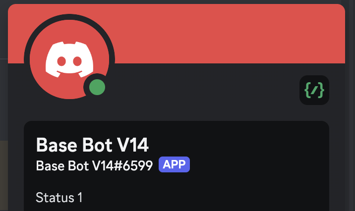
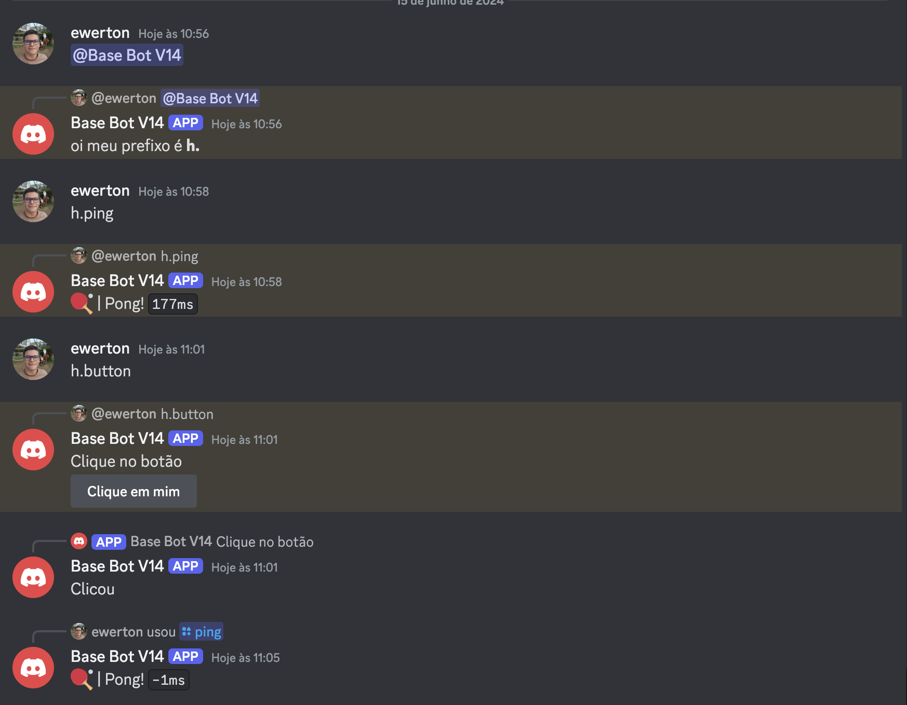

## Base Bot Discord.js V14 usando MongoDb
Uma estrutura simples para você poder iniciar no mundo dos bots utilizando JavaScript.

## Instalação
1. Clone o repositório usando o comando:
```
git clone https://github.com/ewertonlx/base-bot-v14.git
```
2. Instale as dependências do projeto:
```
npm install
```
3. Vá até o arquivo **.env.example** e renomeie o nome do arquivo para **.env** logo em seguida preencha as informações do arquivo, sendo elas:
```
TOKEN=token do bot
MONGODB=URL da database MONGODB
```
4. Abra um novo terminal (certifique-se de que esteja no diretório do projeto) e execute o comando:
```
node .
```
##
Lembre-se de ter o node e o npm instalados em sua máquina.
##
# Imagens


